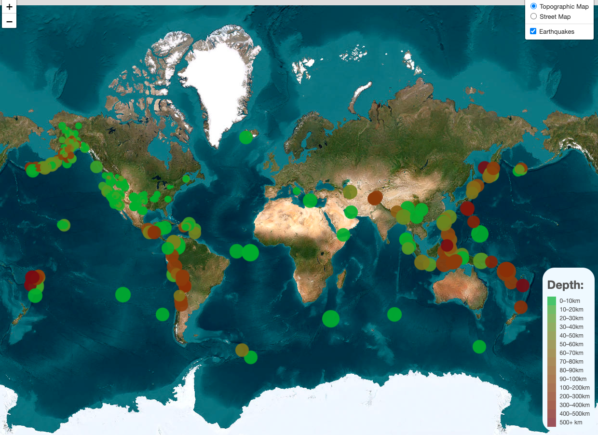

# leaflet-challenge

leaflet-challenege is an exercise to practice creating interactive maps using leaflet. 

To practice these skills, this script aims to produce a map and showcase all earthquakes within the last seven days worldwide. Each earthquake appears as a circle with the  color indicating the depth of the earthquake, and its radius indicating it's magnitude.

</img>

---
Script was made for UCB Data Analytics Challenge 15

Author - Jacob Pohs

Data for script was sourced from USGS Earthquake API